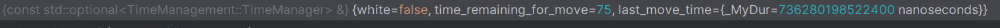
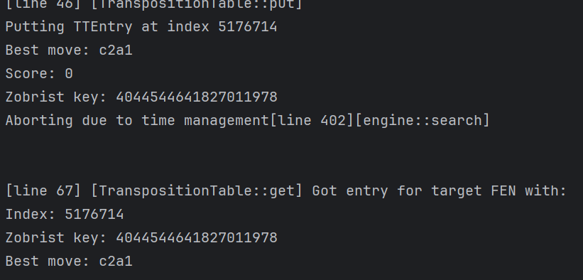

### TRACKER.md - not ChatGPT'ed, the emojis make it look like that, but it's not actually

**Even more minimal examepl**

## ignore below

- negamax()
- Nega_manager: 
- parameters/values:
    - white = false
    - time_remaining_for_move=75
    - last_move_time = 736280198522400 ns (as a duration)

## stop ignoring here

- Ok def problem with the TT appears:
- 
- shows that the tt entry is being put then gotten, INVESTIGATE THE **get** part
- 

**Works and fails: windows**

-       FAILS
        "position startpos moves e2e3 b8c6 b1c3 e7e5 d1g4 g8f6 g4c4 d7d5 c4a4 d5d4 c3d1 f8c5 g1f3 e8g8 b2b3 c6b4 c2c3\n"
        "go wtime 66130 btime 42879 winc 1000 binc 1000\n"
        "position startpos moves e2e3 b8c6 b1c3 e7e5 d1g4 g8f6 g4c4 d7d5 c4a4 d5d4 c3d1 f8c5 g1f3 e8g8 b2b3 c6b4 c2c3 b4c2 e1e2\n"
        "go wtime 66130 btime 42879 winc 1200 binc 1200";

-       FAILS
        "position startpos moves e2e3 b8c6 b1c3 e7e5 d1g4 g8f6 g4c4 d7d5 c4a4 d5d4 c3d1 f8c5 g1f3 e8g8 b2b3 c6b4 c2c3\n"
        "go wtime 66130 btime 42879 winc 1000 binc 1000\n"
        "position startpos moves e2e3 b8c6 b1c3 e7e5 d1g4 g8f6 g4c4 d7d5 c4a4 d5d4 c3d1 f8c5 g1f3 e8g8 b2b3 c6b4 c2c3 b4c2 e1e2\n"
        "go depth 2";
-
-       SUCCEEDS
        "position startpos moves e2e3 b8c6 b1c3 e7e5 d1g4 g8f6 g4c4 d7d5 c4a4 d5d4 c3d1 f8c5 g1f3 e8g8 b2b3 c6b4 c2c3\n"
        "go depth 2\n" //wtime 66130 btime 42879 winc 1000 binc 1000
        "position startpos moves e2e3 b8c6 b1c3 e7e5 d1g4 g8f6 g4c4 d7d5 c4a4 d5d4 c3d1 f8c5 g1f3 e8g8 b2b3 c6b4 c2c3 b4c2 e1e2\n"
        "go depth 2";
-
-       SUCCEEDS
        "position startpos moves e2e3 b8c6 b1c3 e7e5 d1g4 g8f6 g4c4 d7d5 c4a4 d5d4 c3d1 f8c5 g1f3 e8g8 b2b3 c6b4 c2c3\n"
        "go depth 2\n" //wtime 66130 btime 42879 winc 1000 binc 1000
        "position startpos moves e2e3 b8c6 b1c3 e7e5 d1g4 g8f6 g4c4 d7d5 c4a4 d5d4 c3d1 f8c5 g1f3 e8g8 b2b3 c6b4 c2c3 b4c2 e1e2\n"
        "go depth 2";
-
-       FAILS
-       "position startpos moves e2e3 b8c6 b1c3 e7e5 d1g4 g8f6 g4c4 d7d5 c4a4 d5d4 c3d1 f8c5 g1f3 e8g8 b2b3 c6b4 c2c3\n"
        "go wtime 10000 btime 10000\n" //wtime 66130 btime 42879 winc 1000 binc 1000
        "position startpos moves e2e3 b8c6 b1c3 e7e5 d1g4 g8f6 g4c4 d7d5 c4a4 d5d4 c3d1 f8c5 g1f3 e8g8 b2b3 c6b4 c2c3 b4c2 e1e2\n"
        "go depth 2";

-       FAILS
-       "position startpos moves e2e3 b8c6 b1c3 e7e5 d1g4 g8f6 g4c4 d7d5 c4a4 d5d4 c3d1 f8c5 g1f3 e8g8 b2b3 c6b4 c2c3\n"
        "go wtime 1000 btime 1000\n" //wtime 66130 btime 42879 winc 1000 binc 1000
        "position startpos moves e2e3 b8c6 b1c3 e7e5 d1g4 g8f6 g4c4 d7d5 c4a4 d5d4 c3d1 f8c5 g1f3 e8g8 b2b3 c6b4 c2c3 b4c2 e1e2\n"
        "go depth 2";

-       FAILS
-       "position startpos moves e2e3 b8c6 b1c3 e7e5 d1g4 g8f6 g4c4 d7d5 c4a4 d5d4 c3d1 f8c5 g1f3 e8g8 b2b3 c6b4 c2c3\n"
        "go wtime 60000 btime 60000\n" //wtime 66130 btime 42879 winc 1000 binc 1000
        "position startpos moves e2e3 b8c6 b1c3 e7e5 d1g4 g8f6 g4c4 d7d5 c4a4 d5d4 c3d1 f8c5 g1f3 e8g8 b2b3 c6b4 c2c3 b4c2 e1e2\n"
        "go depth 2";
-
-       SUCCEEDS
-         "position startpos moves e2e3 b8c6 b1c3 e7e5 d1g4 g8f6 g4c4 d7d5 c4a4 d5d4 c3d1 f8c5 g1f3 e8g8 b2b3 c6b4 c2c3\n"
           "go depth 2\n" //wtime 66130 btime 42879 winc 1000 binc 1000
          "position startpos moves e2e3 b8c6 b1c3 e7e5 d1g4 g8f6 g4c4 d7d5 c4a4 d5d4 c3d1 f8c5 g1f3 e8g8 b2b3 c6b4 c2c3 b4c2 e1e2\n"
          "go depth 2";

**Commands (need to investigate)(only the target move and the move immediately before that):**
`"position startpos moves e2e3 b8c6 b1c3 e7e5 d1g4 g8f6 g4c4 d7d5 c4a4 d5d4 c3d1 f8c5 g1f3 e8g8 b2b3 c6b4 c2c3\ngo wtime 66130 btime 42879 winc 1000 binc 1000\nposition startpos moves e2e3 b8c6 b1c3 e7e5 d1g4 g8f6 g4c4 d7d5 c4a4 d5d4 c3d1 f8c5 g1f3 e8g8 b2b3 c6b4 c2c3 b4c2 e1e2\ngo wtime 66130 btime 42879 winc 1200 binc 1200";`

- **Comments**
- works on Linux (GitHub Codespaces) but not Windows (22H2 Win 11)
- I have no damn idea why
- To whoever sees this NO i do not have a mental illness (i think)
- need to do windows log
- **Iterations** = `50`
- **Result (Windows)** = `15/50 ❌`
- **Result (Linux)** = `50/50` (no im not adding the check for this)

**Commands (as it would be in a real game)(all the moves):**
`"position startpos moves e2e3\ngo movetime 10000\nsetoption name Ponder value true\nposition startpos moves e2e3 b8c6 b1c3\ngo wtime 60470 btime 57999 winc 1000 binc 1000\nposition startpos moves e2e3 b8c6 b1c3 e7e5 d1g4\ngo wtime 61290 btime 55489 winc 1000 binc 1000\nposition startpos moves e2e3 b8c6 b1c3 e7e5 d1g4 g8f6 g4c4\ngo wtime 62100 btime 53109 winc 1000 binc 1000\nposition startpos moves e2e3 b8c6 b1c3 e7e5 d1g4 g8f6 g4c4 d7d5 c4a4\ngo wtime 62910 btime 50849 winc 1000 binc 1000\nposition startpos moves e2e3 b8c6 b1c3 e7e5 d1g4 g8f6 g4c4 d7d5 c4a4 d5d4 c3d1\ngo wtime 63710 btime 48699 winc 1000 binc 1000\nposition startpos moves e2e3 b8c6 b1c3 e7e5 d1g4 g8f6 g4c4 d7d5 c4a4 d5d4 c3d1 f8c5 g1f3\ngo wtime 64520 btime 46659 winc 1000 binc 1000\nposition startpos moves e2e3 b8c6 b1c3 e7e5 d1g4 g8f6 g4c4 d7d5 c4a4 d5d4 c3d1 f8c5 g1f3 e8g8 b2b3\ngo wtime 65330 btime 44719 winc 1000 binc 1000\nposition startpos moves e2e3 b8c6 b1c3 e7e5 d1g4 g8f6 g4c4 d7d5 c4a4 d5d4 c3d1 f8c5 g1f3 e8g8 b2b3 c6b4 c2c3\ngo wtime 66130 btime 42879 winc 1000 binc 1000\nposition startpos moves e2e3 b8c6 b1c3 e7e5 d1g4 g8f6 g4c4 d7d5 c4a4 d5d4 c3d1 f8c5 g1f3 e8g8 b2b3 c6b4 c2c3 b4c2 e1e2\ngo depth 1";`

- **Iterations** = `50`
- **Result** = `35/50 ❌`

**Commands:**
`"position startpos moves e2e3 b8c6 b1c3 e7e5 d1g4 g8f6 g4c4 d7d5 c4a4 d5d4 c3d1 f8c5 g1f3 e8g8 b2b3 c6b4 c2c3 b4c2 e1e2\ngo wtime 66130 btime 42879 winc 1200 binc 1200";`

- **Iterations** = `50`
- **Result** = `50/50 ✅`

**Commands:**
`"position startpos moves e2e3 b8c6 b1c3 e7e5 d1g4 g8f6 g4c4 d7d5 c4a4 d5d4 c3d1 f8c5 g1f3 e8g8 b2b3 c6b4 c2c3\ngo depth 1\nposition startpos moves e2e3 b8c6 b1c3 e7e5 d1g4 g8f6 g4c4 d7d5 c4a4 d5d4 c3d1 f8c5 g1f3 e8g8 b2b3 c6b4 c2c3 b4c2 e1e2\ngo wtime 66130 btime 42879 winc 1200 binc 1200";`

- **Iterations** = `50`
- **Result** = `50/50 ✅`

**Commands:**
`"position startpos moves e2e3 b8c6 b1c3 e7e5 d1g4 g8f6 g4c4 d7d5 c4a4 d5d4 c3d1 f8c5 g1f3 e8g8 b2b3 c6b4 c2c3\ngo wtime 66130 btime 42879 winc 1000 binc 1000\nposition startpos moves e2e3 b8c6 b1c3 e7e5 d1g4 g8f6 g4c4 d7d5 c4a4 d5d4 c3d1 f8c5 g1f3 e8g8 b2b3 c6b4 c2c3 b4c2 e1e2\ngo depth 1";`

- **Iterations** = `50`
- **Result** = `1/50 ❌`

**Commands:**
`"position startpos moves e2e3 b8c6 b1c3 e7e5 d1g4 g8f6 g4c4 d7d5 c4a4 d5d4 c3d1 f8c5 g1f3 e8g8 b2b3 c6b4 c2c3\ngo depth 1\nposition startpos moves e2e3 b8c6 b1c3 e7e5 d1g4 g8f6 g4c4 d7d5 c4a4 d5d4 c3d1 f8c5 g1f3 e8g8 b2b3 c6b4 c2c3 b4c2 e1e2\ngo depth 1";`

- **Iterations** = `50`
- **Result** = `50/50 ✅`
