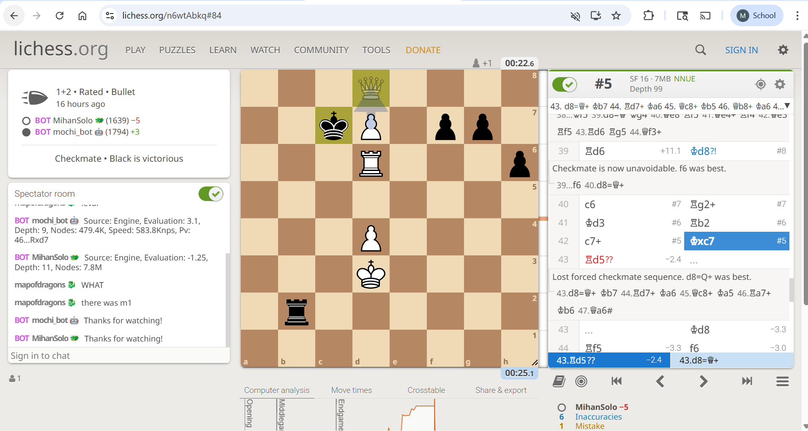
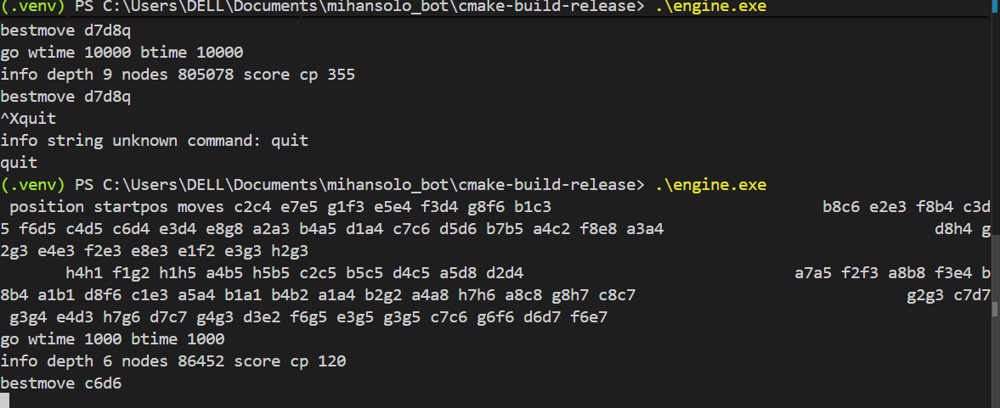

# Draft for issue #3 (discovered in a game vs mochi-bot)



Lichess: [`n6wtAbkq`](https://lichess.org/n6wtAbkq#84)

Problem: goes from mate in 5 to -2.4 (Stockfish 17.1 evaluation)

- Blunder is move `43`,where the engine played the incorrect move `Rd5??` instead of the winning move `d8=Q+`.
- Engine is playing as white

## Reproducing bug

### Moves `42-44`

<details>
<summary><strong>UCI commands </strong> </summary>

```powershell
ucinewgame
isready
position startpos moves c2c4 e7e5 g1f3 e5e4 f3d4 g8f6 b1c3 b8c6 e2e3 f8b4 c3d5 f6d5 c4d5 c6d4 e3d4 e8g8 a2a3 b4a5 d1a4 c7c6 d5d6 b7b5 a4c2 f8e8 a3a4 d8h4 g2g3 e4e3 f2e3 e8e3 e1f2 e3g3 h2g3
```

</details>
<details>
<summary><strong>Relevant log section(s) </strong> </summary>

```powershell
INFO     move: 42
INFO     Searching for wtime 23460 btime 23030 for game n6wtAbkq
DEBUG    <UciProtocol (pid=6928)>: << position startpos moves c2c4 e7e5 g1f3 e5e4 f3d4 g8f6 b1c3 b8c6 e2e3 f8b4 c3d5 f6d5 c4d5 c6d4 e3d4 e8g8 a2a3 b4a5 d1a4 c7c6 d5d6 b7b5 a4c2 f8e8 a3a4 d8h4 g2g3 e4e3 f2e3 e8e3 e1f2 e3g3 h2g3 h4h1 f1g2 h1h5 a4b5 h5b5 c2c5 b5c5 d4c5 a5d8 d2d4 a7a5 f2f3 a8b8 f3e4 b8b4 a1b1 d8f6 c1e3 a5a4 b1a1 b4b2 a1a4 b2g2 a4a8 h7h6 a8c8 g8h7 c8c7 g2g3 c7d7 g3g4 e4d3 h7g6 d7c7 g4g3 d3e2 f6g5 e3g5 g3g5 c7c6 g6f6 d6d7 f6e7 c6d6 e7d8 c5c6  g5g2 e2d3 g2b2
DEBUG    <UciProtocol (pid=6928)>: << go wtime 23460 btime 23030 winc 2000 binc 2000
DEBUG    <UciProtocol (pid=6928)>: >> info depth 10 nodes 7287376 score cp 800
DEBUG    <UciProtocol (pid=6928)>: >> bestmove c6c7
INFO     Source: Engine
INFO     Evaluation: 8.0
INFO     Depth: 10
INFO     Nodes: 7.3M

INFO     move: 43
INFO     Searching for wtime 23180 btime 22690 for game n6wtAbkq
DEBUG    <UciProtocol (pid=6928)>: << position startpos moves c2c4 e7e5 g1f3 e5e4 f3d4 g8f6 b1c3 b8c6 e2e3 f8b4 c3d5 f6d5 c4d5 c6d4 e3d4 e8g8 a2a3 b4a5 d1a4 c7c6 d5d6 b7b5 a4c2 f8e8 a3a4 d8h4 g2g3 e4e3 f2e3 e8e3 e1f2 e3g3 h2g3 h4h1 f1g2 h1h5 a4b5 h5b5 c2c5 b5c5 d4c5 a5d8 d2d4 a7a5 f2f3 a8b8 f3e4 b8b4 a1b1 d8f6 c1e3 a5a4 b1a1 b4b2 a1a4 b2g2 a4a8 h7h6 a8c8 g8h7 c8c7 g2g3 c7d7 g3g4 e4d3 h7g6 d7c7 g4g3 d3e2 f6g5 e3g5 g3g5 c7c6 g6f6 d6d7 f6e7 c6d6 e7d8 c5c6  g5g2 e2d3 g2b2 c6c7 d8c7

DEBUG    <UciProtocol (pid=6928)>: << go wtime 23180 btime 22690 winc 2000 binc 2000
DEBUG    <UciProtocol (pid=6928)>: >> info depth 9 nodes 8097373 score cp 0
DEBUG    <UciProtocol (pid=6928)>: >> bestmove d6d5
INFO     Source: Engine
INFO     Evaluation: 0.0
INFO     Depth: 9
INFO     Nodes: 8.1M

INFO     move: 44
INFO     Searching for wtime 22910 btime 21870 for game n6wtAbkq
DEBUG    <UciProtocol (pid=6928)>: << position startpos moves c2c4 e7e5 g1f3 e5e4 f3d4 g8f6 b1c3 b8c6 e2e3 f8b4 c3d5 f6d5 c4d5 c6d4 e3d4 e8g8 a2a3 b4a5 d1a4 c7c6 d5d6 b7b5 a4c2 f8e8 a3a4 d8h4 g2g3 e4e3 f2e3 e8e3 e1f2 e3g3 h2g3 h4h1 f1g2 h1h5 a4b5 h5b5 c2c5 b5c5 d4c5 a5d8 d2d4 a7a5 f2f3 a8b8 f3e4 b8b4 a1b1 d8f6 c1e3 a5a4 b1a1 b4b2 a1a4 b2g2 a4a8 h7h6 a8c8 g8h7 c8c7 g2g3 c7d7 g3g4 e4d3 h7g6 d7c7 g4g3 d3e2 f6g5 e3g5 g3g5 c7c6 g6f6 d6d7 f6e7 c6d6 e7d8 c5c6  g5g2 e2d3 g2b2 c6c7 d8c7 d6d5 c7d8

DEBUG    <UciProtocol (pid=6928)>: << go wtime 22910 btime 21870 winc 2000 binc 2000
DEBUG    <UciProtocol (pid=6928)>: >> info depth 10 nodes 6732817 score cp -140
DEBUG    <UciProtocol (pid=6928)>: >> bestmove d5f5
INFO     Source: Engine
INFO     Evaluation: -1.4
INFO     Depth: 10
INFO     Nodes: 6.7M
```

</details>

### Moves `1-44`

<details>
<summary><strong> UCI commands </strong> </summary>

```powershell
ucinewgame
isready
```

</details>

## Complications (SOLVED)

The commands
`position startpos moves c2c4 e7e5 g1f3 e5e4 f3d4 g8f6 b1c3 b8c6 e2e3 f8b4 c3d5 f6d5 c4d5 c6d4 e3d4 e8g8 a2a3 b4a5 d1a4 c7c6 d5d6 b7b5 a4c2 f8e8 a3a4 d8h4 g2g3 e4e3 f2e3 e8e3 e1f2 e3g3 h2g3 h4h1 f1g2 h1h5 a4b5 h5b5 c2c5 b5c5 d4c5 a5d8 d2d4 a7a5 f2f3 a8b8 f3e4 b8b4 a1b1 d8f6 c1e3 a5a4 b1a1 b4b2 a1a4 b2g2 a4a8 h7h6 a8c8 g8h7 c8c7 g2g3 c7d7 g3g4 e4d3 h7g6 d7c7 g4g3 d3e2 f6g5 e3g5 g3g5 c7c6 g6f6 d6d7 f6e7`
followed by `go wtime 1000 btime 1000` lead to the output `bestmove d7d8q` (see picture below). However, when other
positions are set up, the output is simply `bestmove x1y2`. Where is the `q` at the end coming from?

Update: even with `go depth 1`, it returns
`info depth 1 nodes 43 score cp 660` then
`bestmove d7d8q`

