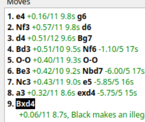

# Reproducing the bug:




## PGN for most recent observation of the bug
```powershell
[Event "My Tournament"]
[Site "?"]
[Date "2025.09.20"]
[Round "1"]
[White "mihan1"]
[Black "mihan2"]
[Result "1-0"]
[ECO "A80"]
[GameDuration "00:00:36"]
[GameEndTime "2025-09-20T14:07:19.994 Eastern Daylight Time"]
[GameStartTime "2025-09-20T14:06:43.754 Eastern Daylight Time"]
[Opening "Dutch"]
[PlyCount "25"]
[Termination "illegal move"]
[TimeControl "200/60"]

1. d4 f5 2. Nf3 g6 3. g3 Bg7 4. Bg2 Nf6 5. c4 d6 6. O-O O-O
7. Nc3 {-4.90/5 3.0s} Nc6 {-5.40/5 3.0s} 8. d5 {-4.75/5 2.8s} Ne5 {-5.35/6 2.8s}
9. Nxe5 {-4.80/6 2.7s} dxe5 {-5.40/6 2.7s} 10. Qc2 {-4.85/5 2.6s}
Bd7 {-5.40/5 2.6s} 11. e4 {-4.80/5 2.4s} fxe4 {-5.35/6 2.4s}
12. Nxe4 {-4.70/6 2.3s} Bf5 {-5.40/7 2.3s}
13. Nxf6+ {-4.85/7 2.2s, Black makes an illegal move: f5c2} 1-0
```
## Engine log for that game
```python
DEBUG: UCI in << uci
DEBUG: UCI in << setoption name Hash value 16
DEBUG: UCI in << setoption name Move Overhead value 30
DEBUG: UCI in << setoption name Threads value 1
DEBUG: UCI in << setoption name UCI_Elo value 1350
DEBUG: UCI in << setoption name UCI_LimitStrength value false
DEBUG: UCI in << isready
DEBUG: UCI in << ucinewgame
DEBUG: UCI in << setoption name Ponder value false
DEBUG: UCI in << position startpos
DEBUG: UCI in << position startpos moves d2d4
DEBUG: UCI in << isready
DEBUG: UCI in << go wtime 59995 btime 60000 movestogo 200
DEBUG: UCI in << position startpos moves d2d4 f7f5 g1f3
DEBUG: UCI in << isready
DEBUG: UCI in << go wtime 59995 btime 59998 movestogo 199
DEBUG: UCI in << position startpos moves d2d4 f7f5 g1f3 g7g6 g2g3
DEBUG: UCI in << isready
DEBUG: UCI in << go wtime 59995 btime 59998 movestogo 198
DEBUG: UCI in << position startpos moves d2d4 f7f5 g1f3 g7g6 g2g3 f8g7 f1g2
DEBUG: UCI in << isready
DEBUG: UCI in << go wtime 59995 btime 59998 movestogo 197
DEBUG: UCI in << position startpos moves d2d4 f7f5 g1f3 g7g6 g2g3 f8g7 f1g2 g8f6 c2c4
DEBUG: UCI in << isready
DEBUG: UCI in << go wtime 59995 btime 59998 movestogo 196
DEBUG: UCI in << position startpos moves d2d4 f7f5 g1f3 g7g6 g2g3 f8g7 f1g2 g8f6 c2c4 d7d6 e1g1
DEBUG: UCI in << isready
DEBUG: UCI in << go wtime 59995 btime 59998 movestogo 195
DEBUG: UCI in << position startpos moves d2d4 f7f5 g1f3 g7g6 g2g3 f8g7 f1g2 g8f6 c2c4 d7d6 e1g1 e8h8 b1c3
DEBUG: UCI in << isready
DEBUG: UCI in << go wtime 56996 btime 59998 movestogo 194
DEBUG: UCI in << position startpos moves d2d4 f7f5 g1f3 g7g6 g2g3 f8g7 f1g2 g8f6 c2c4 d7d6 e1g1 e8h8 b1c3 b8c6 d4d5
DEBUG: UCI in << isready
DEBUG: UCI in << go wtime 54147 btime 56999 movestogo 193
DEBUG: UCI in << position startpos moves d2d4 f7f5 g1f3 g7g6 g2g3 f8g7 f1g2 g8f6 c2c4 d7d6 e1g1 e8h8 b1c3 b8c6 d4d5 c6e5 f3e5
DEBUG: UCI in << isready
DEBUG: UCI in << go wtime 51440 btime 54150 movestogo 192
DEBUG: UCI in << position startpos moves d2d4 f7f5 g1f3 g7g6 g2g3 f8g7 f1g2 g8f6 c2c4 d7d6 e1g1 e8h8 b1c3 b8c6 d4d5 c6e5 f3e5 d6e5 d1c2
DEBUG: UCI in << isreadyDEBUG: UCI in << go wtime 48868 btime 51443 movestogo 191
DEBUG: UCI in << position startpos moves d2d4 f7f5 g1f3 g7g6 g2g3 f8g7 f1g2 g8f6 c2c4 d7d6 e1g1 e8h8 b1c3 b8c6 d4d5 c6e5 f3e5 d6e5 d1c2 c8d7 e2e4
DEBUG: UCI in << isready
DEBUG: UCI in << go wtime 46425 btime 48871 movestogo 190
DEBUG: UCI in << position startpos moves d2d4 f7f5 g1f3 g7g6 g2g3 f8g7 f1g2 g8f6 c2c4 d7d6 e1g1 e8h8 b1c3 b8c6 d4d5 c6e5 f3e5 d6e5 d1c2 c8d7 e2e4 f5e4 c3e4
DEBUG: UCI in << isready
DEBUG: UCI in << go wtime 44104 btime 46428 movestogo 189
DEBUG: UCI in << position startpos moves d2d4 f7f5 g1f3 g7g6 g2g3 f8g7 f1g2 g8f6 c2c4 d7d6 e1g1 e8h8 b1c3 b8c6 d4d5 c6e5 f3e5 d6e5 d1c2 c8d7 e2e4 f5e4 c3e4 d7f5 e4f6
DEBUG: UCI in << isready
DEBUG: UCI in << go wtime 41898 btime 44107 movestogo 188
DEBUG: UCI in << isready
```