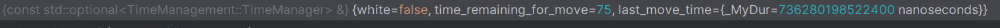
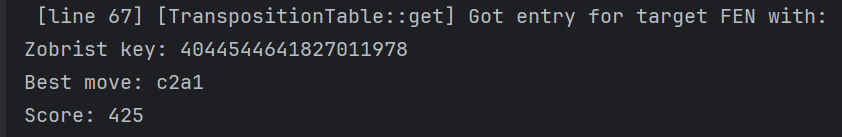
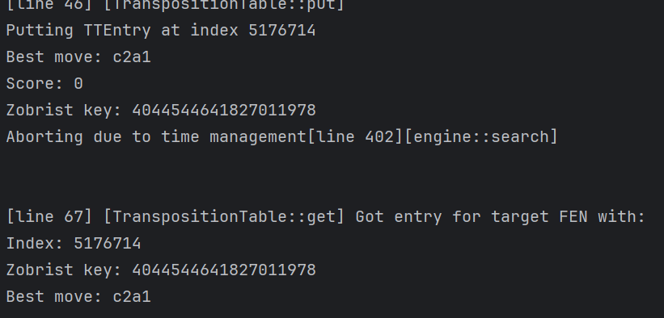

### TRACKER.md - not ChatGPT'ed, the emojis make it look like that, but it's not actually

## LOg output to parse through

C:\Users\DELL\Documents\mihansolo_bot\cmake-build-release\experiments.exe
started main

Minimal reproducible example

no abort [line 396][engine::search]
changed PV Move to: b4c2 [line 398][engine::search]
no abort [line 396][engine::search]
changed PV Move to: b4c2 [line 398][engine::search]
no abort [line 396][engine::search]
changed PV Move to: b4c2 [line 398][engine::search]
no abort [line 396][engine::search]
changed PV Move to: b4c2 [line 398][engine::search]
no abort [line 396][engine::search]
changed PV Move to: b4c2 [line 398][engine::search]
Getting TT entry ...

[line 67] [TranspositionTable::get] Got entry for CHILD of target FEN with:
Index: 5955065
Zobrist key: 18389004031434087929
Best move: f3e5
Score: -425

Evaluating move c2a1 ... with score: 425

Evaluating move d4e3 ... with score: 425

Evaluating move d4c3 ... with score: 425

Evaluating move c2e3 ... with score: 425

Evaluating move g8h8 ... with score: 360

Evaluating move d8e8 ... with score: 340

Evaluating move e5e4 ... with score: 405

Evaluating move a7a6 ... with score: 355

Evaluating move b7b6 ... with score: 370

Evaluating move c7c6 ... with score: 415

Evaluating move g7g6 ... with score: 355

Evaluating move h7h6 ... with score: 370

Evaluating move a7a5 ... with score: 365

Evaluating move b7b5 ... with score: 0

Evaluating move g7g5 ... with score: 0

Evaluating move h7h5 ... with score: 0

Evaluating move c2e1 ... with score: 0

Evaluating move c2a3 ... with score: 0

Evaluating move c2b4 ... with score: 0

Evaluating move f6e4 ... with score: 0

Evaluating move f6g4 ... with score: 0

Evaluating move f6d5 ... with score: 0

Evaluating move f6h5 ... with score: 0

Evaluating move f6d7 ... with score: 0

Evaluating move f6e8 ... with score: 0

Evaluating move c5a3 ... with score: 0

Evaluating move c5b4 ... with score: 0

Evaluating move c5b6 ... with score: 0

Evaluating move c5d6 ... with score: 0

Evaluating move c5e7 ... with score: 0

Evaluating move c8h3 ... with score: 0

Evaluating move c8g4 ... with score: 0

Evaluating move c8f5 ... with score: 0

Evaluating move c8e6 ... with score: 0

Evaluating move a8b8 ... with score: 0

Evaluating move f8e8 ... with score: 0

Evaluating move d8d5 ... with score: 0

Evaluating move d8d6 ... with score: 0

Evaluating move d8d7 ... with score: 0

Evaluating move d8e7 ... with score: 0

Evaluating move d4d3 ... with score: 0

Evaluating move c8d7 ... with score: 0

Negamax PUTTING entry for zobrist key: 4044544641827011978
Index: 5176714
Best move: c2a1
Score: 425

Params:
Board FEN: r1bq1rk1/ppp2ppp/5n2/2b1p3/Q2p4/1PP1PN2/P1nPKPPP/R1BN1B1R b - - 2 10
Alpha: -2147483647
Beta: 2147483647
Depth: 4
Ply: 2
Last move: e1e2
PV_Move: b4c2

[line 46] [TranspositionTable::put]
Putting TTEntry at index 5176714
Best move: c2a1
Score: 425
Zobrist key: 4044544641827011978
Aborting due to time management[line 402][engine::search]

[line 79] [TranspositionTable::get] Got entry for target FEN with:
Index: 5176714
Zobrist key: 4044544641827011978
Best move: c2a1
Score: 425

[line 79] [TranspositionTable::get] Got entry for target FEN with:
Index: 5176714
Zobrist key: 4044544641827011978
Best move: c2a1
Score: 425

info depth 7 nodes 14929 score cp 9997
bestmove b4c2
info depth 2 nodes 2 score cp 425
bestmove c2a1

FAILURE

**Even more minimal examepl**

## ignore below

- negamax()
- Nega_manager: 
- parameters/values:
  - white = false
  - time_remaining_for_move=75
  - last_move_time = 736280198522400 ns (as a duration)

## stop ignoring here

- Ok def problem with the TT appears:
- 
- shows that the tt entry is being put then gotten, INVESTIGATE THE **get** part
- 

**Works and fails: windows**
-       FAILS
        "position startpos moves e2e3 b8c6 b1c3 e7e5 d1g4 g8f6 g4c4 d7d5 c4a4 d5d4 c3d1 f8c5 g1f3 e8g8 b2b3 c6b4 c2c3\n"
        "go wtime 66130 btime 42879 winc 1000 binc 1000\n"
        "position startpos moves e2e3 b8c6 b1c3 e7e5 d1g4 g8f6 g4c4 d7d5 c4a4 d5d4 c3d1 f8c5 g1f3 e8g8 b2b3 c6b4 c2c3 b4c2 e1e2\n"
        "go wtime 66130 btime 42879 winc 1200 binc 1200";

-       FAILS
        "position startpos moves e2e3 b8c6 b1c3 e7e5 d1g4 g8f6 g4c4 d7d5 c4a4 d5d4 c3d1 f8c5 g1f3 e8g8 b2b3 c6b4 c2c3\n"
        "go wtime 66130 btime 42879 winc 1000 binc 1000\n"
        "position startpos moves e2e3 b8c6 b1c3 e7e5 d1g4 g8f6 g4c4 d7d5 c4a4 d5d4 c3d1 f8c5 g1f3 e8g8 b2b3 c6b4 c2c3 b4c2 e1e2\n"
        "go depth 2";
- 
-       SUCCEEDS
        "position startpos moves e2e3 b8c6 b1c3 e7e5 d1g4 g8f6 g4c4 d7d5 c4a4 d5d4 c3d1 f8c5 g1f3 e8g8 b2b3 c6b4 c2c3\n"
        "go depth 2\n" //wtime 66130 btime 42879 winc 1000 binc 1000
        "position startpos moves e2e3 b8c6 b1c3 e7e5 d1g4 g8f6 g4c4 d7d5 c4a4 d5d4 c3d1 f8c5 g1f3 e8g8 b2b3 c6b4 c2c3 b4c2 e1e2\n"
        "go depth 2";
- 
-       SUCCEEDS
        "position startpos moves e2e3 b8c6 b1c3 e7e5 d1g4 g8f6 g4c4 d7d5 c4a4 d5d4 c3d1 f8c5 g1f3 e8g8 b2b3 c6b4 c2c3\n"
        "go depth 2\n" //wtime 66130 btime 42879 winc 1000 binc 1000
        "position startpos moves e2e3 b8c6 b1c3 e7e5 d1g4 g8f6 g4c4 d7d5 c4a4 d5d4 c3d1 f8c5 g1f3 e8g8 b2b3 c6b4 c2c3 b4c2 e1e2\n"
        "go depth 2";
- 
-       FAILS
-       "position startpos moves e2e3 b8c6 b1c3 e7e5 d1g4 g8f6 g4c4 d7d5 c4a4 d5d4 c3d1 f8c5 g1f3 e8g8 b2b3 c6b4 c2c3\n"
        "go wtime 10000 btime 10000\n" //wtime 66130 btime 42879 winc 1000 binc 1000
        "position startpos moves e2e3 b8c6 b1c3 e7e5 d1g4 g8f6 g4c4 d7d5 c4a4 d5d4 c3d1 f8c5 g1f3 e8g8 b2b3 c6b4 c2c3 b4c2 e1e2\n"
        "go depth 2";

-       FAILS
-       "position startpos moves e2e3 b8c6 b1c3 e7e5 d1g4 g8f6 g4c4 d7d5 c4a4 d5d4 c3d1 f8c5 g1f3 e8g8 b2b3 c6b4 c2c3\n"
        "go wtime 1000 btime 1000\n" //wtime 66130 btime 42879 winc 1000 binc 1000
        "position startpos moves e2e3 b8c6 b1c3 e7e5 d1g4 g8f6 g4c4 d7d5 c4a4 d5d4 c3d1 f8c5 g1f3 e8g8 b2b3 c6b4 c2c3 b4c2 e1e2\n"
        "go depth 2";

-       FAILS
-       "position startpos moves e2e3 b8c6 b1c3 e7e5 d1g4 g8f6 g4c4 d7d5 c4a4 d5d4 c3d1 f8c5 g1f3 e8g8 b2b3 c6b4 c2c3\n"
        "go wtime 60000 btime 60000\n" //wtime 66130 btime 42879 winc 1000 binc 1000
        "position startpos moves e2e3 b8c6 b1c3 e7e5 d1g4 g8f6 g4c4 d7d5 c4a4 d5d4 c3d1 f8c5 g1f3 e8g8 b2b3 c6b4 c2c3 b4c2 e1e2\n"
        "go depth 2";
-
-       SUCCEEDS
-         "position startpos moves e2e3 b8c6 b1c3 e7e5 d1g4 g8f6 g4c4 d7d5 c4a4 d5d4 c3d1 f8c5 g1f3 e8g8 b2b3 c6b4 c2c3\n"
           "go depth 2\n" //wtime 66130 btime 42879 winc 1000 binc 1000
          "position startpos moves e2e3 b8c6 b1c3 e7e5 d1g4 g8f6 g4c4 d7d5 c4a4 d5d4 c3d1 f8c5 g1f3 e8g8 b2b3 c6b4 c2c3 b4c2 e1e2\n"
          "go depth 2";

**Commands (need to investigate)(only the target move and the move immediately before that):**
`"position startpos moves e2e3 b8c6 b1c3 e7e5 d1g4 g8f6 g4c4 d7d5 c4a4 d5d4 c3d1 f8c5 g1f3 e8g8 b2b3 c6b4 c2c3\ngo wtime 66130 btime 42879 winc 1000 binc 1000\nposition startpos moves e2e3 b8c6 b1c3 e7e5 d1g4 g8f6 g4c4 d7d5 c4a4 d5d4 c3d1 f8c5 g1f3 e8g8 b2b3 c6b4 c2c3 b4c2 e1e2\ngo wtime 66130 btime 42879 winc 1200 binc 1200";`

- **Comments** 
 - works on Linux (GitHub Codespaces) but not Windows (22H2 Win 11)
 - I have no damn idea why
 - To whoever sees this NO i do not have a mental illness (i think)
 - need to do windows log
- **Iterations** = `50`
- **Result (Windows)** = `15/50 ❌`
- **Result (Linux)** = `50/50` (no im not adding the check for this)

**Commands (as it would be in a real game)(all the moves):**
`"position startpos moves e2e3\ngo movetime 10000\nsetoption name Ponder value true\nposition startpos moves e2e3 b8c6 b1c3\ngo wtime 60470 btime 57999 winc 1000 binc 1000\nposition startpos moves e2e3 b8c6 b1c3 e7e5 d1g4\ngo wtime 61290 btime 55489 winc 1000 binc 1000\nposition startpos moves e2e3 b8c6 b1c3 e7e5 d1g4 g8f6 g4c4\ngo wtime 62100 btime 53109 winc 1000 binc 1000\nposition startpos moves e2e3 b8c6 b1c3 e7e5 d1g4 g8f6 g4c4 d7d5 c4a4\ngo wtime 62910 btime 50849 winc 1000 binc 1000\nposition startpos moves e2e3 b8c6 b1c3 e7e5 d1g4 g8f6 g4c4 d7d5 c4a4 d5d4 c3d1\ngo wtime 63710 btime 48699 winc 1000 binc 1000\nposition startpos moves e2e3 b8c6 b1c3 e7e5 d1g4 g8f6 g4c4 d7d5 c4a4 d5d4 c3d1 f8c5 g1f3\ngo wtime 64520 btime 46659 winc 1000 binc 1000\nposition startpos moves e2e3 b8c6 b1c3 e7e5 d1g4 g8f6 g4c4 d7d5 c4a4 d5d4 c3d1 f8c5 g1f3 e8g8 b2b3\ngo wtime 65330 btime 44719 winc 1000 binc 1000\nposition startpos moves e2e3 b8c6 b1c3 e7e5 d1g4 g8f6 g4c4 d7d5 c4a4 d5d4 c3d1 f8c5 g1f3 e8g8 b2b3 c6b4 c2c3\ngo wtime 66130 btime 42879 winc 1000 binc 1000\nposition startpos moves e2e3 b8c6 b1c3 e7e5 d1g4 g8f6 g4c4 d7d5 c4a4 d5d4 c3d1 f8c5 g1f3 e8g8 b2b3 c6b4 c2c3 b4c2 e1e2\ngo depth 1";`

- **Iterations** = `50`
- **Result** = `35/50 ❌`

**Commands:**
`"position startpos moves e2e3 b8c6 b1c3 e7e5 d1g4 g8f6 g4c4 d7d5 c4a4 d5d4 c3d1 f8c5 g1f3 e8g8 b2b3 c6b4 c2c3 b4c2 e1e2\ngo wtime 66130 btime 42879 winc 1200 binc 1200";`

- **Iterations** = `50`
- **Result** = `50/50 ✅`

**Commands:**
`"position startpos moves e2e3 b8c6 b1c3 e7e5 d1g4 g8f6 g4c4 d7d5 c4a4 d5d4 c3d1 f8c5 g1f3 e8g8 b2b3 c6b4 c2c3\ngo depth 1\nposition startpos moves e2e3 b8c6 b1c3 e7e5 d1g4 g8f6 g4c4 d7d5 c4a4 d5d4 c3d1 f8c5 g1f3 e8g8 b2b3 c6b4 c2c3 b4c2 e1e2\ngo wtime 66130 btime 42879 winc 1200 binc 1200";`

- **Iterations** = `50`
- **Result** = `50/50 ✅`

**Commands:**
`"position startpos moves e2e3 b8c6 b1c3 e7e5 d1g4 g8f6 g4c4 d7d5 c4a4 d5d4 c3d1 f8c5 g1f3 e8g8 b2b3 c6b4 c2c3\ngo wtime 66130 btime 42879 winc 1000 binc 1000\nposition startpos moves e2e3 b8c6 b1c3 e7e5 d1g4 g8f6 g4c4 d7d5 c4a4 d5d4 c3d1 f8c5 g1f3 e8g8 b2b3 c6b4 c2c3 b4c2 e1e2\ngo depth 1";`

- **Iterations** = `50`
- **Result** = `1/50 ❌`

**Commands:**
`"position startpos moves e2e3 b8c6 b1c3 e7e5 d1g4 g8f6 g4c4 d7d5 c4a4 d5d4 c3d1 f8c5 g1f3 e8g8 b2b3 c6b4 c2c3\ngo depth 1\nposition startpos moves e2e3 b8c6 b1c3 e7e5 d1g4 g8f6 g4c4 d7d5 c4a4 d5d4 c3d1 f8c5 g1f3 e8g8 b2b3 c6b4 c2c3 b4c2 e1e2\ngo depth 1";`

- **Iterations** = `50`
- **Result** = `50/50 ✅`
